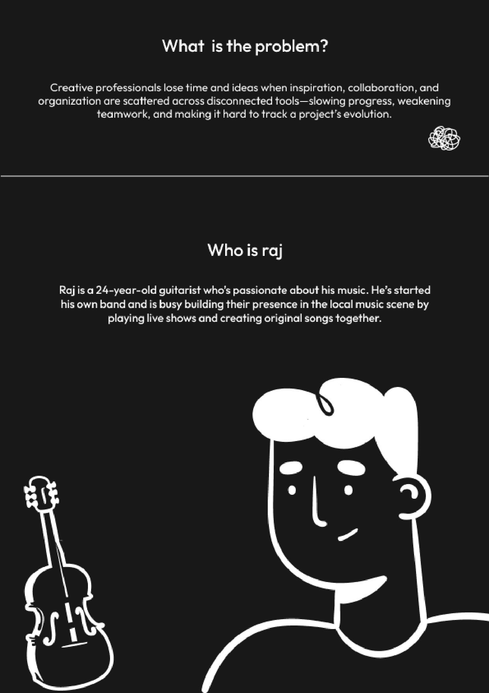
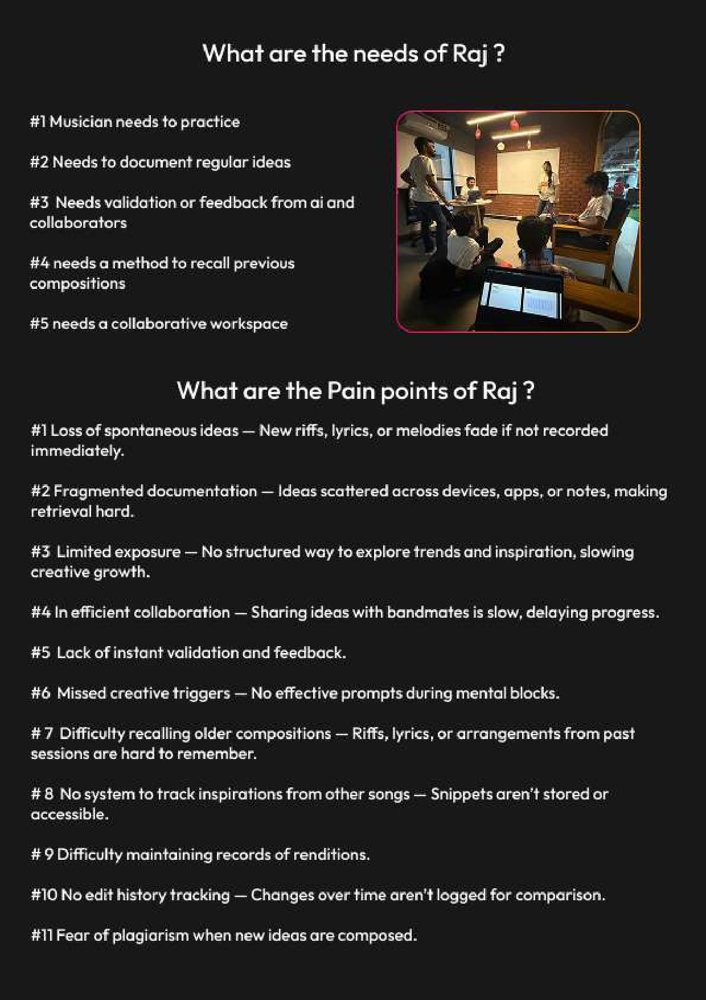
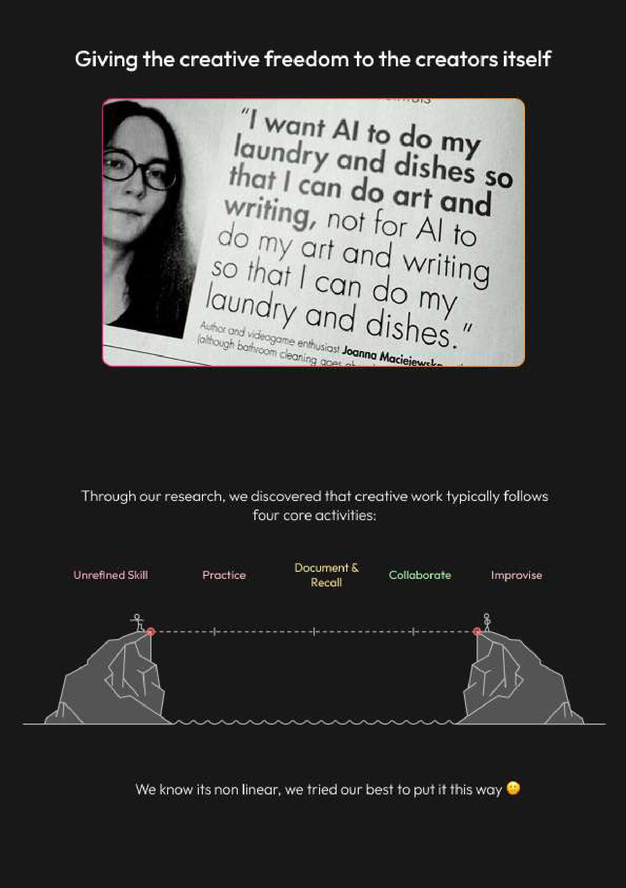
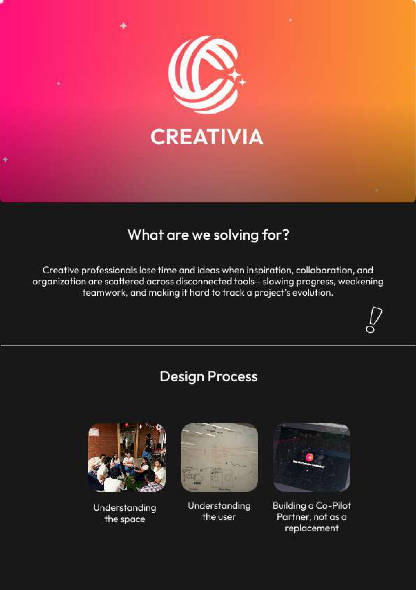
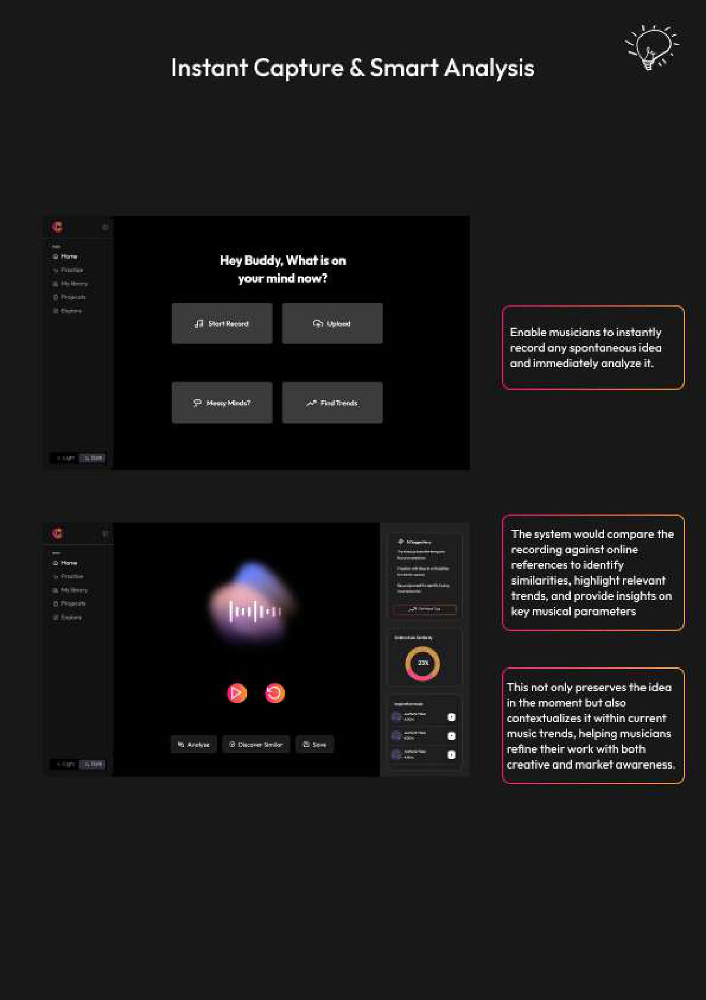
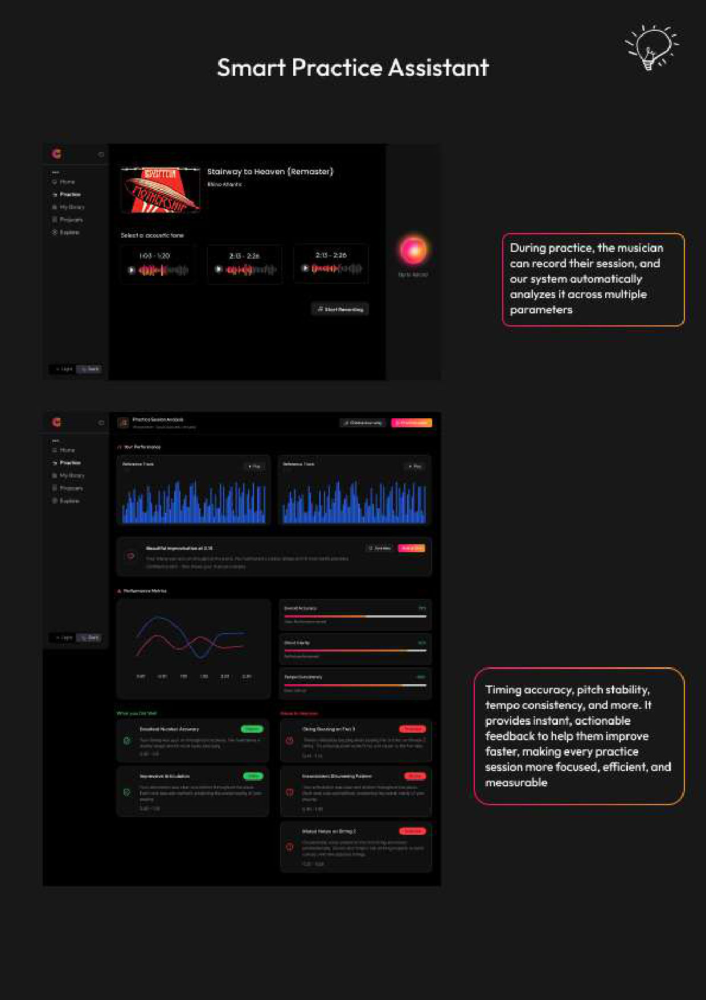
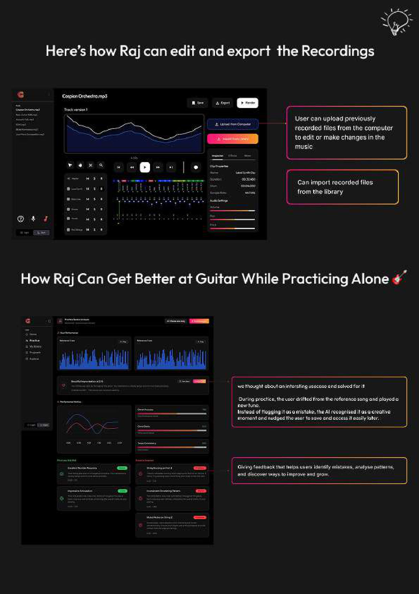
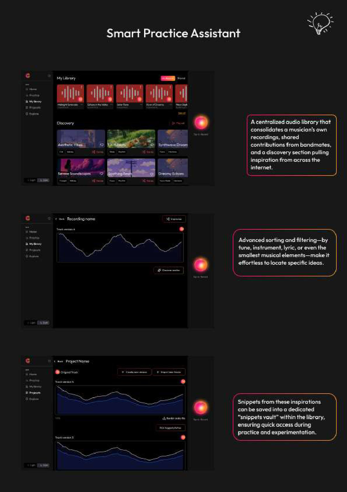
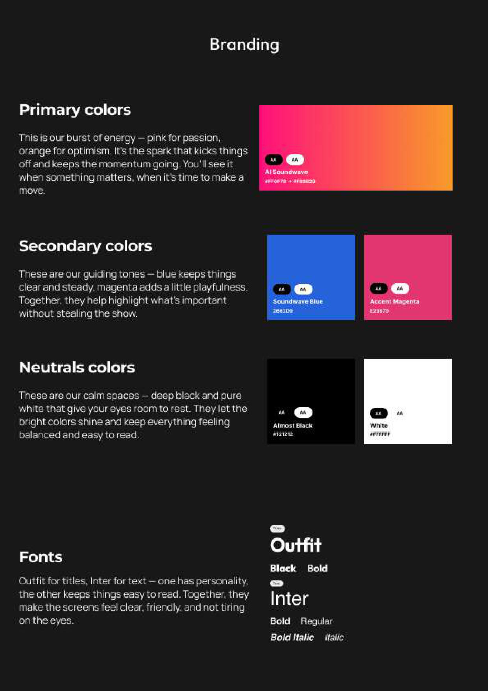
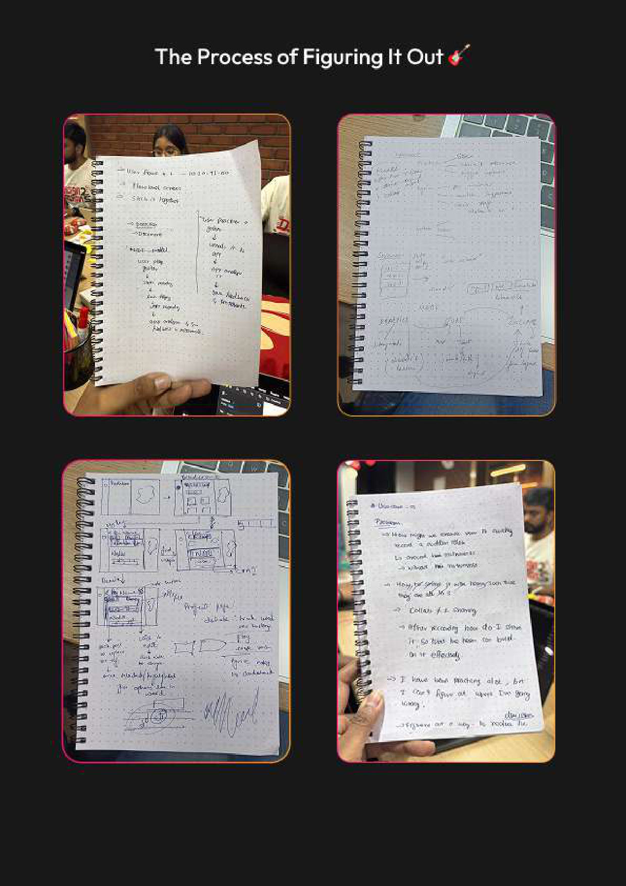

# CREATIVIA — A Creative Co‑Pilot for Musicians

[-2662d9)](#meet-raj)

> **"Creative flow is fragile, and every break costs more than a moment — it costs momentum."**

**CREATIVIA** is an AI **co‑pilot for musicians** — a creative partner that captures sparks the instant they happen, turns solo practice into measurable progress, and keeps a band's ideas in one searchable place. It was designed in 24 hours at the **[Lollypop Designathon 2025](https://lollypop.design/designathon-2025/)** by **Team 6**, around the persona of **Raj, a 24‑year‑old guitarist**.

This folder is the **case study + content home** for the project. A small **working demo** for the portfolio is planned next — see [Status & Roadmap](#status--roadmap).

---

## TL;DR

| | |
|---|---|
| **What** | An AI creative co‑pilot for musicians: capture → analyse → practise → organise |
| **Why** | Creatives lose ideas, time, and momentum when inspiration, collaboration, and organisation are scattered across disconnected tools |
| **For whom** | Raj — a gigging guitarist building his band in the local scene |
| **The bet** | A *partner, not a prompt box* — ambient, real‑time, visual interactions instead of a chat window |
| **Where** | Lollypop Designathon 2025 · Bangalore · 8–9 Aug 2025 · 24‑hour in‑person design sprint |
| **Team** | Team 6 (8 designers), mentored by Karan Gautam |

---

## The brief

> *As generative AI evolves into a creative partner, the classic chat interface has outlived its usefulness. How do we empower creatives to augment their creative process and collaborate with AI in innovative ways **without breaking their creative flow**?*

The challenge was to design a **Creative Copilot** — an AI‑powered assistant that supports and augments creativity **without relying solely on a chat box**. The judging brief asked us to:

- **Explore new modes of interaction** — visual, spatial, ambient, or real‑time responsive systems.
- **Adapt to the nuances of the creative process** — experimentation, iteration, improvisation.
- **Feel like a partner — not a prompt box.**

We picked the **Musician** persona (Raj) — the highest‑bonus track in the brief — because music creation is intensely flow‑dependent and a perfect stress‑test for "don't break the flow."

---

## The problem

Creative professionals lose time and ideas when **inspiration, collaboration, and organisation are scattered across disconnected tools** — slowing progress, weakening teamwork, and making it hard to track a project's evolution.

We don't think linearly when we create. We hop between tabs, references, ideas, drafts, and chats. Flow is a delicate mental state where ideas connect effortlessly and time fades — and every context switch breaks it.

---

## Meet Raj

> Raj is a **24‑year‑old guitarist** who's passionate about his music. He's started his own band and is busy building their presence in the local music scene by playing live shows and creating original songs together.

His creative life spans three recurring use cases from the brief:

1. **Songwriting** — practising the instrument, uncovering new licks/riffs, penning lyrics, and collaborative songwriting with the band.
2. **Active listening** — learning solos and rhythm parts from his idols, documenting riffs to replicate live, aligning the band on a target sound.
3. **Rehearsals** — songwriting rehearsals (editing ideas on the fly, take by take) and performance rehearsals (recalling lyrics, cues, and parts as setlists evolve).

### What Raj needs

1. To **practise** consistently and improve.
2. To **document regular ideas** before they fade.
3. To get **validation / feedback** — from AI *and* from collaborators.
4. A **collaborative workspace** for the band.

### Raj's pain points

| # | Pain point |
|---|------------|
| 1 | **Loss of spontaneous ideas** — riffs, lyrics, melodies fade if not recorded immediately |
| 2 | **Fragmented documentation** — ideas scattered across devices, apps, and notes; hard to retrieve |
| 3 | **Limited exposure** — no structured way to explore trends and inspiration; creative growth stalls |
| 4 | **Inefficient collaboration** — sharing ideas with bandmates is slow, delaying progress |
| 5 | **Wasted creative triggers** — no effective prompts during mental blocks |
| 6 | **Hard to recall old compositions** — past riffs, lyrics, and arrangements are easy to forget |
| 7 | **Hard to track iterations** — snippets across songs aren't stored or accessible |
| 8 | **Hard to maintain records** of renditions across versions |
| 9 | **No edit‑history tracking** — changes over time aren't logged for comparison |
| 10 | **Fear of plagiarism** when new ideas are composed |

---

## The insight

The team's guiding principle came from a line we kept coming back to:

> *"I want AI to do my laundry and dishes so that I can do my art and writing — not for AI to do my art and writing so that I can do my laundry and dishes."*
> — Joanna Maciejewska

So we set a hard design constraint: **give the creative freedom back to the creator.** CREATIVIA does the dishes — capture, analysis, organisation, recall — so Raj keeps the art.

Through research we found that creative work tends to cycle through a handful of activities — **unrefined skill → practice → document & recall → collaborate → improvise** — and that the loop is **non‑linear**. The product had to support *jumping between* these states, not march through them.

### Design principles

- **A co‑pilot, not a replacement.** AI assists the craft; it never makes the art.
- **Capture without friction.** The fastest path from spark to saved.
- **Beyond the chat box.** Visual, ambient, real‑time‑responsive interactions.
- **Built for the band.** Individual flow that rolls up into shared, collaborative work.

---

## The solution

CREATIVIA wraps four capabilities around Raj's day, all reachable from one home prompt: **"Hey Buddy, what's on your mind now?"** — *Start Record · Upload · Messy Minds? · Find Trends.*

### 1 · Instant Capture & Smart Analysis

Record any spontaneous idea the moment it strikes and analyse it immediately. The system compares the recording against online references to **identify similar music, surface relevant trends, and report on key musical parameters** — preserving the idea *and* contextualising it within the current scene, so Raj refines with both creative and market awareness. Capture flows straight into **Analyse · Discover Similar · Save**.

### 2 · Smart Practice Assistant

During practice, Raj records a session and CREATIVIA analyses it across multiple parameters — **timing accuracy, pitch stability, tempo consistency, and more** — against a chosen reference track. It returns **instant, actionable feedback**, identifies every mistake and bottleneck, and tracks efficiency over time, making each session more focused, efficient, and measurable.

### 3 · Iterate, edit & export

Raj can pick his best takes across iterations, **edit and export** recordings, upload files from his computer, or pull recordings straight from his library — turning rough sessions into release‑ready parts.

### 4 · Media Library & Snippets Vault

A **centralised media library** consolidates Raj's own recordings, shared annotations, and a discovery panel pulling inspiration from across the internet. **Advanced search and filtering** — by tune, instrument, lyric, or the smallest musical element — make ideas effortless to locate, and the best moments drop into a dedicated **Snippets Vault** built up during practice and experimentation.

---

## Brand system

A high‑energy palette on a calm, dark canvas — built so the bright colours carry meaning and the neutrals let the eyes rest.

| Role | Token | Hex | Notes |
|------|-------|-----|-------|
| Primary | **AI Soundwave** (gradient) | `#FE1E72 → #F89030` | Pink for passion, orange for optimism — the spark that keeps momentum going |
| Secondary | **Soundwave Blue** | `#2662D9` | Keeps things clear and steady |
| Secondary | **Accent Magenta** | `#E32678` | A little playfulness without stealing the show |
| Neutral | **Almost Black** | `#121212` | The calm canvas |
| Neutral | **White** | `#FFFFFF` | Room for the eyes to rest |

**Type:** **Outfit** for titles (personality), **Inter** for body (clear, friendly, easy to read).

---

## Process

Twenty‑four hours of figuring it out — understanding the space, understanding the user, and committing to a *co‑pilot, not a replacement.*

> The full screen gallery lives in [`assets/screens/`](assets/screens/). A long‑form write‑up is in [`docs/CASE_STUDY.md`](docs/CASE_STUDY.md), and the brand system is detailed in [`docs/BRAND.md`](docs/BRAND.md).

---

## Status & roadmap

**Current status:** concept + content. This folder captures the Designathon submission as a structured case study so it can be showcased in a portfolio.

| Phase | Scope | State |
|-------|-------|-------|
| **0 · Content** | Case study, persona, features, brand system, screen gallery | ✅ this folder |
| **1 · Demo scaffold** | Static portfolio page (Vite, `pnpm`) presenting the case study + screens | ⏳ planned |
| **2 · Interactive demo** | Click‑through of the key flows (capture → analyse → practice → library) | ⏳ planned |
| **3 · Polish** | Motion, responsive layout, deploy for the portfolio site | ⏳ planned |

See [`docs/ROADMAP.md`](docs/ROADMAP.md) for the detailed plan. Build tooling for the eventual demo follows the [workspace rules](../AGENTS.md): **`pnpm` only**, pinned model IDs for any AI calls.

---

## Team

A team of **eight product designers** — Team 6 — designed CREATIVIA in 24 hours at the Lollypop Designathon 2025, mentored by **Karan Gautam**. We split into pods the way a full product‑design team would:

| Pod | Members | Focus |
|-----|---------|-------|
| **Product direction (PM)** | Rajashekar · Dharanitharan R | Holistic product management — scope, priorities, and keeping the concept coherent end to end |
| **Persona & research** | Akash Kumaraguru · Cherrisha U Shetty | Building out Raj's persona, use cases, and pain points |
| **Presentation & dashboards** | Drishti Jain · **Tushar Kant Naik** | The show‑reel/presentation and the practice & analytics dashboard screens |
| **Graphics** | Anu Murugan · Tamilselvan | Visual assets, illustration, and brand graphics |

**My role — Tushar Kant Naik.** With Drishti I built the **presentation and the dashboard** screens (the practice analytics / performance‑metrics views). Beyond that, I shaped several of the **niche features baked into the app** — the smaller, opinionated interactions that make CREATIVIA feel like a *partner, not a prompt box.*

**Portfolio owner:** Tushar Kant Naik — this folder hosts the case study and the planned working demo for [tusharkantnaik.com](https://tusharkantnaik.com).

---

## Credits & license

- **Concept & design:** Team 6, Lollypop Designathon 2025. The original product concept and visual design are the collective work of the team.
- **Event:** [Lollypop Design Studio](https://lollypop.design/) — see the [Designathon 2025 page](https://lollypop.design/designathon-2025/). "Lollypop" and the Designathon are the property of Lollypop Design Studio; this folder documents Team 6's entry for educational and portfolio purposes.
- **Source brief & persona:** the Designathon problem statement and Musician persona provided by Lollypop.
- **Code & docs in this folder:** [MIT](LICENSE) © 2025 Tushar Kant Naik.

The MIT license covers the source code and documentation authored in this folder (the case study write‑up and any future demo code). It does **not** transfer rights to the Lollypop brand or the team's original design IP.

---

*Part of the [Side‑Kicks](../README.md) workspace. AI builders: start at [`AGENTS.md`](AGENTS.md).*
