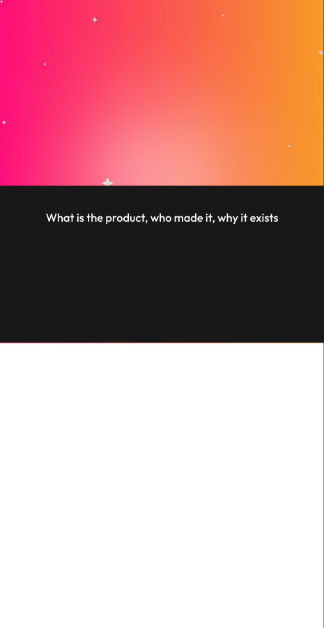
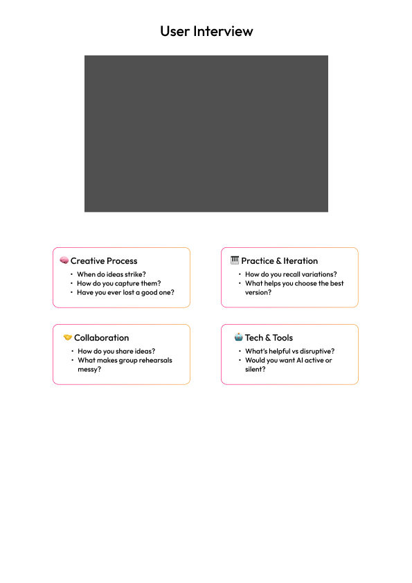
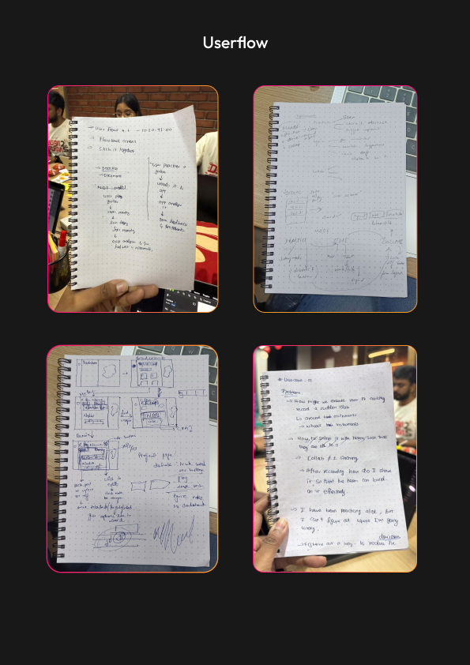
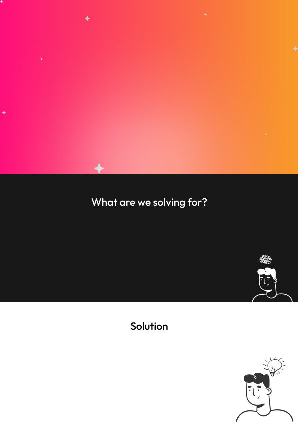
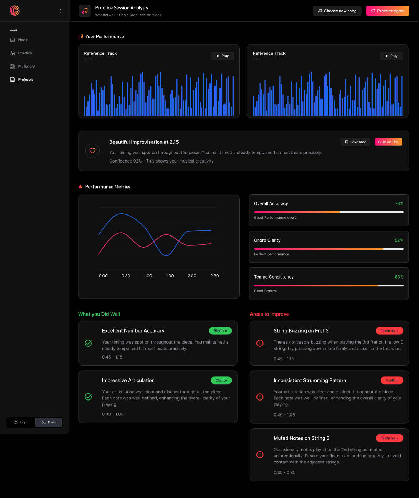
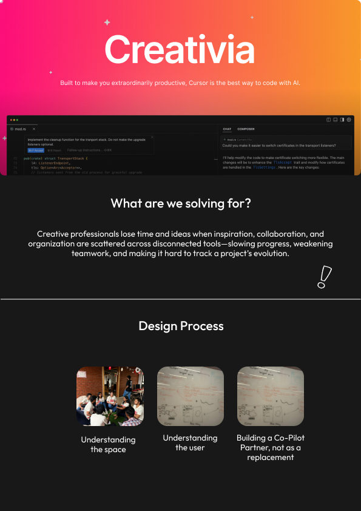

# CREATIVIA — Case Study

> Long-form companion to the [README](../README.md). The README is the canonical
> narrative; this file expands the research, persona, and feature detail. Keep
> the two consistent.

**An AI creative co‑pilot for musicians**, designed in 24 hours at the
[Lollypop Designathon 2025](https://lollypop.design/designathon-2025/) by
**Team 6**, around the persona of **Raj, a 24‑year‑old guitarist**.

---

## 1. Context — the Designathon

The Lollypop Designathon 2025 was a **24‑hour, in‑person design sprint** held in
Bangalore on **8–9 August 2025**. Participants were design students and early‑career
professionals, selected by portfolio review, and briefed on the theme only on the
day of the event.

**Program flow (abridged):**

| Day | Time | Event |
|-----|------|-------|
| 08 Aug | 9:30–11:00 | Welcome, registrations & high‑tea |
| 08 Aug | 11:00–12:00 | Introduction, icebreakers & Designathon brief |
| 08 Aug | 12:00 onwards | **Designathon starts** |
| 08 Aug | 15:00–16:00 | Mentor session 1 |
| 08 Aug | 22:00–23:00 | Mentor session 2 |
| 09 Aug | 06:00 | **Clock stops** |
| 09 Aug | 07:30–09:30 | First‑round panel (6 teams shortlisted) |
| 09 Aug | 10:00–11:30 | Final jury (10‑min presentation + QnA per finalist) |
| 09 Aug | 11:30–12:00 | Winner announcement & closing |

**Deliverables:** a **2‑minute show reel** (MP4) plus an **A4 process document** (PDF).

**Evaluation:** Round 1 judged on *Creativity, User Empathy, Interaction Design, AI
Integration, Craft* (+ persona bonus points). Round 2 weighted 50% round‑one criteria
and 50% the live presentation.

---

## 2. The brief

> *Creative flow is fragile, and every break costs more than a moment — it costs momentum.*
>
> *As generative AI evolves into a creative partner, the classic chat interface has
> outlived its usefulness. How do we empower creatives to augment their creative process
> and collaborate with AI in innovative ways without breaking their creative flow?*

The challenge: design a **Creative Copilot** — an AI assistant that supports and
augments creativity **without relying solely on a chat box**. Three things to honour:

- **New modes of interaction** — visual, spatial, ambient, real‑time responsive.
- **The nuances of the creative process** — experimentation, iteration, improvisation.
- **A partner, not a prompt box.**

**Persona choice.** The brief offered three tracks: **Musician** (+5 bonus), **Game
Designer** (+3 bonus), or any other creative (0 bonus). Team 6 chose the **Musician** —
the most flow‑dependent and the highest‑bonus track.

---

## 3. The persona — Raj

> Raj is a 24‑year‑old guitarist. He has a band of his own and is working to establish
> its name in the local music scene by playing live gigs and writing original
> compositions. He balances work and music, practising individually and rehearsing with
> the band to tighten their sets.

Raj's life maps to three use cases from the persona brief:

### Use case 1 — Songwriting
- **Instrument:** hours of consistent practice — pieces, scales, finger exercises — to
  stay in top playing form. Mid‑practice he uncovers new licks/riffs that spark song
  ideas and documents them to develop and share later.
- **Lyric:** he writes lyrics, minding rhyme, imagery, and meaning. Sometimes the
  instrument leads the story; sometimes words arrive first and must be captured
  immediately, then matched to music.
- **Collaborative songwriting:** he shares work with bandmates so they can edit it or
  build their own parts, and welcomes feedback — the band needs synergy.

### Use case 2 — Active listening
Listening shapes a musician's identity. Raj studies his idols on repeat, learns solos
and rhythm parts, documents riffs to replicate live, and shares song sections with the
band to align on a target sound and quality.

### Use case 3 — Rehearsals
- **Songwriting rehearsals:** the band demonstrates documented ideas live, editing on
  the fly take by take, logging changes, and splicing the best sections into the perfect
  part.
- **Performance rehearsals:** setlists evolve by venue and audience. Recalling lyrics,
  cues, and each member's parts is a struggle — forgotten cues between songs and between
  movements break the band's momentum.

---

## 4. Research

### Method — user interviews

Before designing, Team 6 ran **user interviews** structured around four themes (captured on
the research frame in the design file):

| Theme | Questions explored |
|-------|--------------------|
| 🧠 **Creative Process** | When do ideas strike? How do you capture them? Have you ever lost a good one? |
| 🎹 **Practice & Iteration** | How do you recall variations? What helps you choose the best version? |
| 🤝 **Collaboration** | How do you share ideas? What makes group rehearsals messy? |
| 🤖 **Tech & Tools** | What's helpful vs disruptive? Would you want AI *active* or *silent*? |

That last question — *active or silent?* — shaped the whole product: CREATIVIA stays
ambient and on‑demand, never a chatbot demanding attention.

### Synthesis — the affinity board

The interviews and persona were mapped on a large affinity board across five lenses —
**Target Audience · What Raj does · Needs · Pain points · Key Pointers** — and broken down
by the three use cases (Songwriting, Active Listening, Rehearsals). The "Key Pointers" lens
framed *who* to build for: **Target‑Audience Discoverability, Geography, Relevance,
Popularity.** Notable signals that surfaced here (and fed the features): *"needs a record of
liked snippets — easily selectable & sharable," "requirement of triggers to remove mental
blocks," "needs a history/timeline," "splice sections from multiple tracks," "maintaining
file‑format consistency for smoother workflow,"* and *"align teammates on a singular aim in
sound & quality."*

**The problem, stated:** Creative professionals lose time and ideas when inspiration,
collaboration, and organisation are scattered across disconnected tools — slowing progress,
weakening teamwork, and making it hard to track a project's evolution.

### What Raj needs (5)
1. To **practise** to maintain form.
2. To **document regular ideas** immediately.
3. **Validation / feedback** — from AI *and* collaborators.
4. A **method to recall previous compositions**.
5. A **collaborative workspace** for the band.

### Raj's pain points (11)
1. **Loss of spontaneous ideas** — new riffs, lyrics, or melodies fade if not recorded immediately.
2. **Fragmented documentation** — ideas scattered across devices, apps, or notes; retrieval is hard.
3. **Limited exposure** — no structured way to explore trends and inspiration; creative growth slows.
4. **Inefficient collaboration** — sharing ideas with bandmates is slow, delaying progress.
5. **Lack of instant validation and feedback.**
6. **Missed creative triggers** — no effective prompts during mental blocks.
7. **Difficulty recalling older compositions** — past riffs, lyrics, or arrangements are hard to remember.
8. **No system to track inspirations from other songs** — snippets aren't stored or accessible.
9. **Difficulty maintaining records of renditions.**
10. **No edit‑history tracking** — changes over time aren't logged for comparison.
11. **Fear of plagiarism** when something new is composed.

---

## 5. The insight & design principles

The team anchored on Joanna Maciejewska's line:

> *"I want AI to do my laundry and dishes so that I can do my art and writing — not for
> AI to do my art and writing so that I can do my laundry and dishes."*

So the constraint became: **give the creative freedom back to the creator.** CREATIVIA
handles capture, analysis, organisation, and recall — the "dishes" — and leaves the art
to Raj.

Research showed creative work cycles through five states —
**Unrefined Skill → Practice → Document & Recall → Collaborate → Refined Skill** — and that
the loop is **non‑linear** (*"we know it's non‑linear; we tried our best to put it this
way"*). The product had to support jumping between these states rather than enforcing a sequence.

**Design process — three moves:** *understanding the space* → *understanding the user* →
**building a co‑pilot partner, not a replacement.**

**Design principles**
- **A co‑pilot, not a replacement.** AI assists the craft; it never makes the art.
- **Capture without friction.** The shortest path from spark to saved.
- **Beyond the chat box.** Visual, ambient, real‑time‑responsive interactions.
- **Built for the band.** Individual flow that rolls up into shared work.

---

## 6. The solution

Everything is reachable from one home prompt — **"Hey Buddy, what's on your mind now?"** —
with four entry points: **Start Record · Upload · Messy Minds? · Find Trends.**

### 6.1 Instant Capture & Smart Analysis
Record any spontaneous idea the instant it strikes and analyse it immediately. CREATIVIA
compares the recording against online references to **identify similar music, surface
relevant trends, and report key musical parameters** — preserving the idea *and*
contextualising it within the current scene. Capture flows into **Analyse · Discover
Similar · Save**, so an idea never dies in the moment and Raj refines with both creative
and market awareness.

### 6.2 Smart Practice Assistant
Raj selects a reference track (e.g. a remaster), records a section, and CREATIVIA analyses
the take across **timing accuracy, pitch stability, tempo consistency, string changes,
and more**. It returns **instant, actionable feedback**, pinpoints every mistake and
bottleneck, and visualises reference‑vs‑user waveforms and performance metrics — making
each session focused, efficient, and measurable, with progress tracked over time.

### 6.3 Iterate, edit & export
Raj picks his best takes across iterations, **edits and exports** recordings, uploads
files from his computer, or imports recordings from his library — turning rough sessions
into release‑ready parts and preserving the evolution of a song.

### 6.4 Media Library & Snippets Vault
A **centralised media library** consolidates Raj's recordings, shared annotations, and a
discovery panel pulling inspiration from across the internet. **Advanced search and
filtering** — by tune, instrument, lyric, or the smallest musical element — make ideas
effortless to find, and the best moments land in a dedicated **Snippets Vault** built up
during practice and experimentation.

### The landing concept

A **CREATIVIA landing page** was mocked alongside the product, distilling the design
process behind it — *understanding the space → understanding the user → building a co‑pilot
partner, not a replacement.*

### How the features answer the pain points

| Pain point | Addressed by |
|------------|--------------|
| Loss of spontaneous ideas (1) | Instant Capture |
| Fragmented documentation (2) | Media Library |
| Limited exposure / trends (3) | Smart Analysis · Find Trends |
| Inefficient collaboration (4) | Shared annotations · band workspace |
| Lack of instant validation & feedback (5) | Smart Analysis feedback |
| Missed creative triggers (6) | "Messy Minds?" prompts |
| Recalling older compositions (7) | Library + advanced search |
| No system to track inspirations (8) | Snippets Vault |
| Maintaining records of renditions (9) | Versioned library |
| No edit‑history tracking (10) | Iteration history |
| Fear of plagiarism (11) | Similarity / reference comparison in Analysis |

---

## 7. Brand & craft

See [`BRAND.md`](BRAND.md) for the full token set. In short: a high‑energy
**pink→orange "AI Soundwave"** gradient for momentum, **Soundwave Blue** and **Accent
Magenta** as supporting tones, on an **Almost Black** canvas with **White** for rest.
Type pairs **Outfit** (titles) with **Inter** (body).

---

## 8. Team & attribution

A team of **eight product designers** — Team 6 — built CREATIVIA in 24 hours, mentored by
**Karan Gautam**, organised into pods like a full product‑design team:

| Pod | Members | Focus |
|-----|---------|-------|
| Product direction (PM) | Rajashekar · Dharanitharan R | Holistic PM — scope, priorities, end‑to‑end coherence |
| Persona & research | Akash Kumaraguru · Cherrisha U Shetty | Raj's persona, use cases, pain points |
| Presentation & dashboards | Drishti Jain · **Tushar Kant Naik** | Show‑reel/presentation + practice & analytics dashboards |
| Graphics | Anu Murugan · Tamilselvan | Visual assets, illustration, brand graphics |

**Tushar Kant Naik (portfolio owner):** built the presentation and dashboard screens with
Drishti, and shaped several of the niche features baked into the app.

The concept and visual design are the team's collective work. This case study documents
the entry for educational and portfolio purposes — see [`../LICENSE`](../LICENSE) for the
design‑IP note.

---

## 9. Artifacts & sources

**Design artifacts captured** into [`../assets/figma/`](../assets/figma/): the cover, the
**user‑interview** frame, the **Practice Session Analysis dashboard**, the **userflow**
sketches, and the **landing‑page** concept. (The page itself is named *"Documentation"* in
the Figma file.)

**Sources:**
- Lollypop Designathon 2025 problem statement (brief, program flow, evaluation).
- Musician persona brief (Raj — use cases 1–3).
- Team 6's **Figma design file** (`aY0lWks0P4pMxdAIB694TV`) — the design page (node
  `2:433`) and the affinity/research board (node `129:5851`); the source of the brand
  tokens, the user‑interview research, the canonical needs/pains, and the images in
  [`../assets/figma/`](../assets/figma/).
- Team 6's A4 process document (PDF) — the source of the gallery in
  [`../assets/screens/`](../assets/screens/).
- [Designathon 2025 event page](https://lollypop.design/designathon-2025/).
